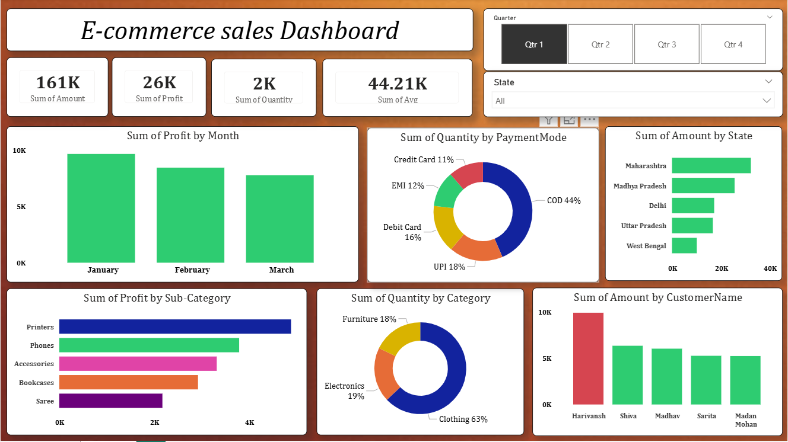

# 📊 E-Commerce Sales Dashboard (Power BI)

## 📌 Project Overview
This project presents an interactive **E-Commerce Sales Dashboard** built using Power BI to analyze sales performance, customer behavior, and business insights.

The dashboard helps in understanding:
- Sales trends
- Profit analysis
- Category performance
- Regional sales distribution
- Customer purchasing patterns

---

## 🚀 Tools & Technologies Used
- Power BI
- Microsoft Excel / CSV
- Data Cleaning
- Data Visualization
- Business Intelligence (BI)

---

## 📂 Dataset
The project uses two datasets:

- Orders.csv → Contains order-level information
- Details.csv → Contains product and transaction details

---

## 📈 Dashboard Features
- KPI Cards (Sales, Profit, Quantity)
- Monthly Sales Analysis
- Category-wise Performance
- Profit & Loss Visualization
- Interactive Filters & Slicers

---

## 🖼 Dashboard Preview

---

## 🎯 Key Insights
- Identified top-performing product categories
- Analyzed profitable regions
- Observed seasonal sales patterns
- Compared revenue vs profit trends

---

## 📁 Files Included
- power bi dashboard.pbix → Power BI dashboard file
- Orders.csv → Dataset
- Details.csv → Dataset
- dashboard_preview.png → Dashboard screenshot

---

## 👩‍💻 Author
**Chhayangi Nishad**

📧 Email: chhayanginishad@gmail.com

---

## ⭐ If you like this project
Give this repository a ⭐ on GitHub!
